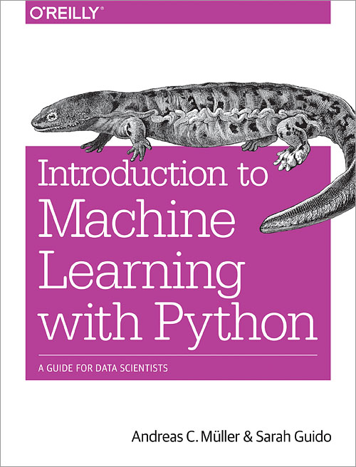
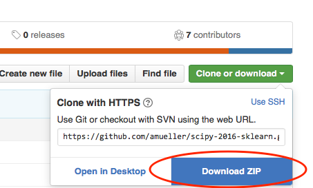
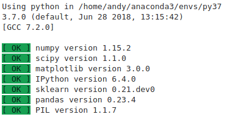

# Intro_ML_Python_Notes

This repository provides the notebooks which holds the note along with the code form the book "Introduction to Machine
Learning with Python" by [Andreas Mueller](http://amueller.io) and [Sarah Guido](https://twitter.com/sarah_guido).
You can find details about the book on the [O'Reilly website](http://shop.oreilly.com/product/0636920030515.do).

"This book is a fantastic, super-practical resourse for anyone who wants to start using machine learning in pyhton- I just wish that it had existed when I started using scikit-learn!"         -**Hanna Wallach**

This book has a additional library [mglearn](https://github.com/amueller/mglearn) as helper functions to create figures and
datasets. If you get ``ImportError: No module named mglearn`` you can try to install mglearn into your python environment. All datasets are included in the repository.

## Setup

To run the code, you need the packages ``numpy``, ``scipy``, ``scikit-learn``, ``matplotlib``, ``pandas`` and ``pillow``.
Some of the visualizations of decision trees and neural networks structures also require ``graphviz``. The chapter
on text processing also requirs ``nltk`` and ``spacy``.

The easiest way to set up an environment is by installing [Anaconda](https://www.continuum.io/downloads), Or you can use [Google Colab](https://colab.research.google.com/notebooks/intro.ipynb) notebooks to execute code, Google's cloud servers, meaning you can leverage the power of Google hardware, including GPUs.

### Installing packages with conda:
If you already have a Python environment set up, and you are using the ``conda`` package manager, you can get all packages by running

    conda install numpy scipy scikit-learn matplotlib mglearn pandas pillow graphviz python-graphviz

For the chapter on text processing you also need to install ``nltk`` and ``spacy``:

    conda install nltk spacy

In google colab all the libraries are preinstalled except mglearn

## Introduction to Machine Learning with Python



This book is for Machine learnig practitioners looking to implement solution to the real-world ML problems, this book doesn't require any previous knowledge of ML, but it is understood that reader of the book has prior knowledge of linear algebra and probabilities though this book doesn't go indeapth analysis of algoritms.

### Navigation of this book:

- **Chapter 1:** Introduces the fundamental concepts of machine learning and its applications.
- **Chapters 2 & 3:** Describes the actual machine learning algorithms that are most widely used in practice,
and discuss their advantages and shortcomings.
- **Chapter 4:** Discusses the importance of how we represent data that is processed by machine learning.
- **Chapter 5:** Covers advanced methods for model evaluation and parameter tuning.
- **Chapter 6:** Explains the concept of pipelines for chaining models and encapsulating the workflow.
- **Chapter 7:** Shows how to apply the methods described in earlier chapters to text data, and introduces some text-specific processing techniques.
- **Chapter 8:** Offers a high-level overview, and includes references to more advanced topics.


Obtaining the Tutorial Material
--------------------------------


If you are familiar with git, it is probably most convenient if you clone the GitHub repository. This
is highly encouraged as it allows you to easily synchronize any changes to the material.

```
git clone https://github.com/amueller/ml-training-intro.git
```

If you are not familiar with git, you can download the repository as a .zip file by heading over to the GitHub repository (https://github.com/amueller/ml-training-intro) in your browser and click the green “Download” button in the upper right.



Please note that I may add and improve the material until shortly before the tutorial session, and we recommend you to update your copy of the materials one day before the tutorials. If you have an GitHub account and forked/cloned the repository via GitHub, you can sync your existing fork with via the following commands:

```
git pull origin master
```


Installation Notes
------------------

This tutorial will require recent installations of

- [NumPy](http://www.numpy.org)
- [SciPy](http://www.scipy.org)
- [matplotlib](http://matplotlib.org)
- [pillow](https://python-pillow.org)
- [pandas](http://pandas.pydata.org)
- [scikit-learn](http://scikit-learn.org/stable/) (>=0.18.1)
- [IPython](http://ipython.readthedocs.org/en/stable/)
- [Jupyter Notebook](http://jupyter.org)

The last one is important, you should be able to type:

    jupyter notebook

in your terminal window and see the notebook panel load in your web browser.
Try opening and running a notebook from the material to see check that it works.

For users who do not yet have these  packages installed, a relatively
painless way to install all the requirements is to use a Python distribution
such as [Anaconda](https://www.continuum.io/downloads), which includes
the most relevant Python packages for science, math, engineering, and
data analysis; Anaconda can be downloaded and installed for free
including commercial use and redistribution.
The code examples in this tutorial should be compatible to Python 2.7,
Python 3.4 and later. However, it's recommended to use a recent Python version (like
3.5 or 3.6).

After obtaining the material, we **strongly recommend** you to open and execute
a Jupyter Notebook `jupter notebook check_env.ipynb` that is located at the
top level of this repository. Inside the repository, you can open the notebook
by executing

```bash
jupyter notebook check_env.ipynb
```

inside this repository. Inside the Notebook, you can run the code cell by
clicking on the "Run Cells" button as illustrated in the figure below:


Finally, if your environment satisfies the requirements for the tutorials, the executed code cell will produce an output message as shown below:


